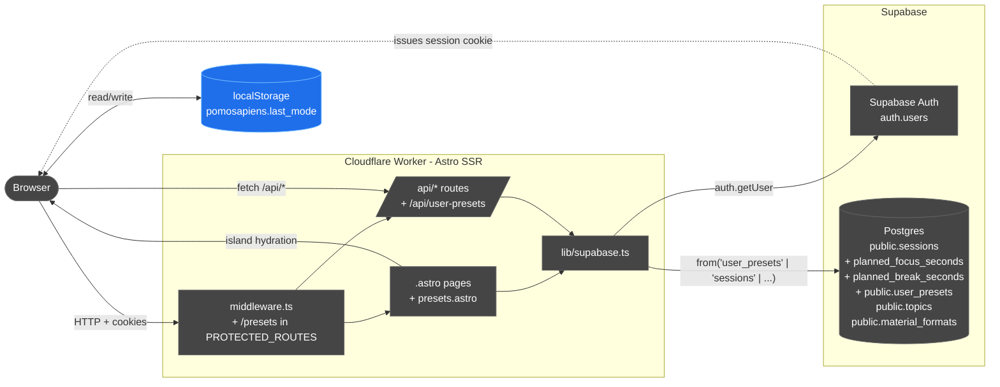
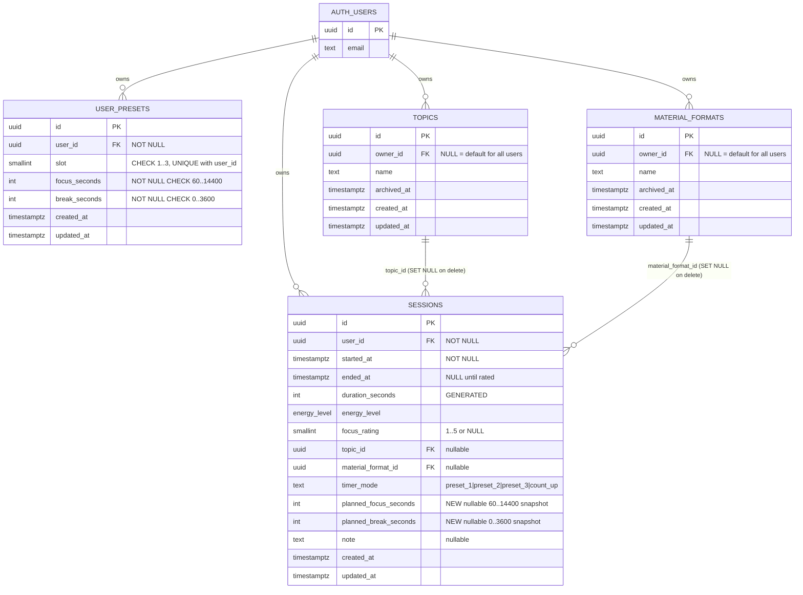
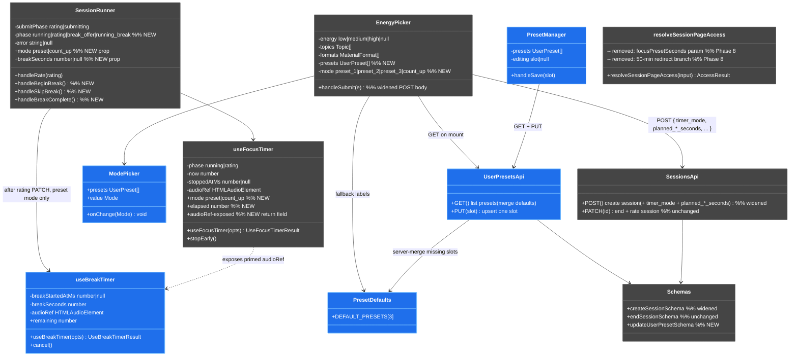
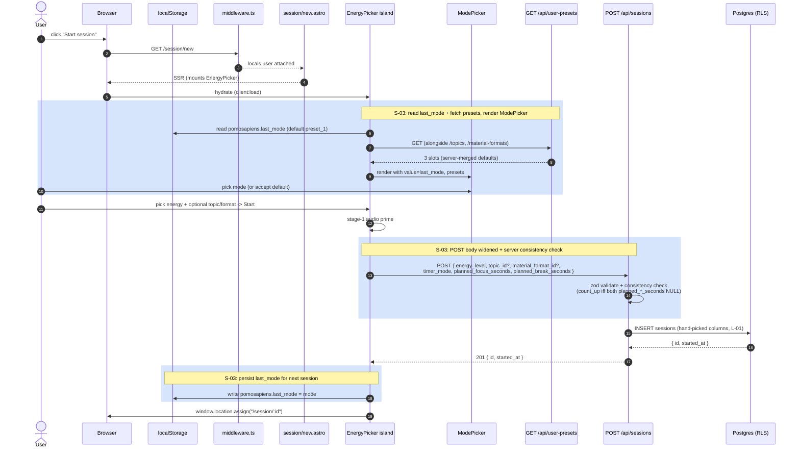
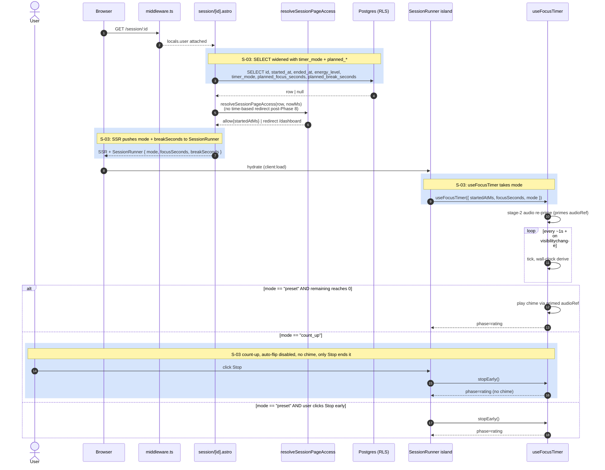
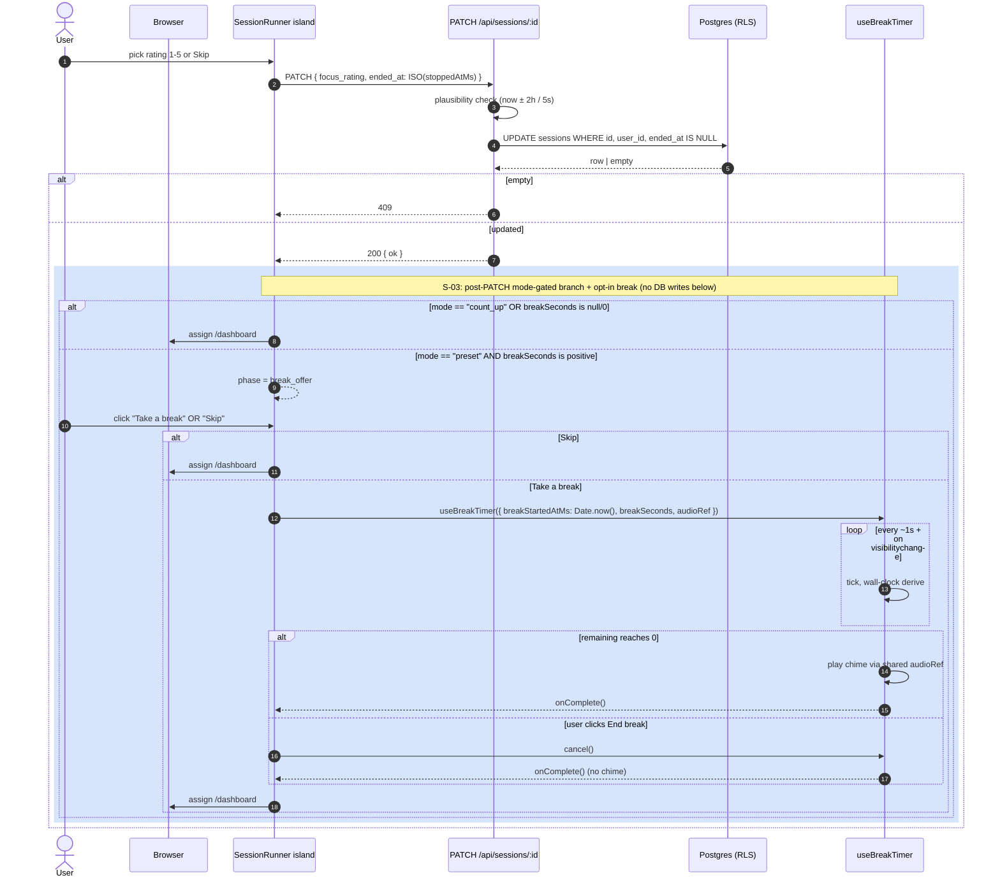
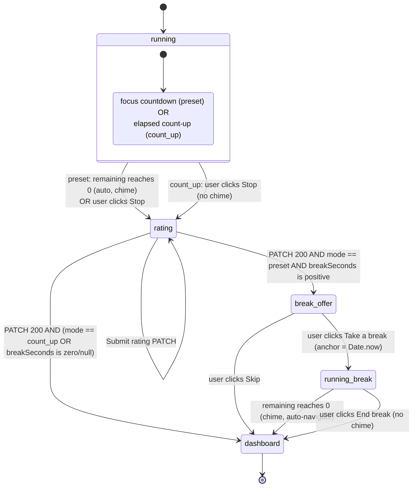

# Timer Presets + Count-Up Mode (S-03) — Architecture Delta

Architecture diagrams for the change planned in [plan.md](./plan.md). Reference baseline: [context/foundation/arch.md](../../foundation/arch.md) (snapshot 2026-06-28). This document only shows the **delta** — what S-03 adds, renames, or removes — against that baseline.

> Convention: existing pieces (whether modified or not) are styled **gray** `fill:#e5e5e5,stroke:#666,color:#222`; brand-new pieces are styled **blue** `fill:#1f6feb,stroke:#79c0ff,color:#fff`; removed pieces are styled **red/dashed** `fill:#7d1f1f,stroke:#ff9494,color:#fff,stroke-dasharray: 4 2`. A modified existing box stays gray and notes what changed in its label.

---

## 1. System context (delta)

The CFW ↔ Supabase topology is unchanged. The delta is one new table (`user_presets`), two new nullable columns on `sessions`, and the `localStorage` channel between the dashboard island and the Browser.

Notes on the delta:

- **`localStorage` is a new state channel.** It carries one key (`pomosapiens.last_mode`) read on dashboard mount and written on POST success. The server has no view into it; the dashboard SSR always renders with the `preset_1` fallback and the client effect overrides on hydration. No SSR/CSR mismatch surface beyond the chip pre-selection.
- **No new worker, no new Supabase product surface.** No edge functions, no realtime, no storage — same shape as today.
- **Middleware change is one-line:** `/presets` added to `PROTECTED_ROUTES`. The exact-match `AUTHED_REDIRECTS` map is untouched.

---

## 2. Module map (delta)

New modules in blue, modified modules in blue, removed modules in red-dashed. Unchanged modules are omitted to keep the diagram focused on the delta.

```mermaid
flowchart TB
    subgraph pages[src/pages]
        sessId["session/[id].astro<br/>reads planned_focus_seconds, planned_break_seconds,<br/>timer_mode from row"]:::existing
        sessNew[session/new.astro]:::existing
        dash[dashboard.astro<br/>+ timer_mode in SELECT + mode badge<br/>- ABANDONED_THRESHOLD_MS / abandoned status]:::existing
        presetsPg[presets.astro]:::new
        apiPresets[api/user-presets/*<br/>GET + PUT &#91;slot&#93;]:::new
        apiSess["api/sessions/index.ts<br/>POST writes timer_mode +<br/>planned_focus_seconds +<br/>planned_break_seconds"]:::existing
    end

    subgraph components[src/components]
        SR["session/SessionRunner.tsx<br/>+ mode, breakSeconds props<br/>+ phases: break_offer, running_break"]:::existing
        EP["session/EnergyPicker.tsx<br/>+ presets fetch<br/>+ ModePicker<br/>+ localStorage last_mode<br/>+ POST widening"]:::existing
        MP[session/ModePicker.tsx]:::new
        PM[presets/PresetManager.tsx]:::new
    end

    subgraph lib[src/lib]
        TIMER["timer/useFocusTimer.ts<br/>+ mode prop<br/>+ exposes audioRef<br/>+ count-up disables auto-flip"]:::existing
        BREAK[timer/useBreakTimer.ts]:::new
        DEFAULTS[timer/preset-defaults.ts]:::new
        ACCESS["session/access.ts<br/>- focusPresetSeconds param<br/>- 50-min redirect branch"]:::existing
        SCHEMAS_EXIST["schemas/session.ts<br/>POST widened"]:::existing
        SCHEMAS_NEW["schemas/user-preset.ts"]:::new
    end

    subgraph db[src/db]
        TYPES["database.types.ts<br/>+ user_presets<br/>+ planned_*_seconds"]:::existing
    end

    sessId --> ACCESS
    sessId --> SR
    sessNew --> EP
    presetsPg --> PM
    dash --> apiSess

    SR --> TIMER
    SR --> BREAK
    EP --> MP
    EP --> apiPresets
    PM --> apiPresets

    apiPresets --> SCHEMAS_NEW
    apiPresets --> DEFAULTS
    apiSess --> SCHEMAS_EXIST
    EP --> DEFAULTS

    classDef existing fill:#454545,stroke:#666,color:#fff
    classDef new fill:#1f6feb,stroke:#79c0ff,color:#fff
    classDef removed fill:#7d1f1f,stroke:#ff9494,color:#fff,stroke-dasharray: 4 2
```

What this delta is **not** showing (because nothing changes):

- `lib/supabase.ts`, `lib/parse-request.ts`, `lib/utils.ts` — untouched.
- The topics and material-formats CRUD path (`api/topics/*`, `api/material-formats/*`, `TopicManager`, `MaterialFormatManager`) — untouched.
- Auth pages and API (`api/auth/*`, `auth/*.astro`) — untouched.
- `session/new.astro` — untouched (it just mounts `EnergyPicker`, which absorbs the new picker internally).

---

## 3. Domain model (delta)

Schema delta: new `user_presets` table + two new nullable columns on `sessions`. No FK from `sessions` to `user_presets` — the planned durations are **snapshotted** onto the session row at POST time so they survive any later edit of `user_presets`.

RLS posture for the new table:

- `user_presets`: per-operation policies scoped to `authenticated`; row visibility requires `user_id = auth.uid()`. **No NULL-owner clause** — unlike `topics` / `material_formats`, presets are strictly per-user. Defaults live in app code (`src/lib/timer/preset-defaults.ts`) and are merged server-side by `GET /api/user-presets`, not seeded into the table.
- Why no FK from `sessions.planned_*_seconds` back to `user_presets`? The columns are a **point-in-time snapshot**, not a reference. The whole point of the audit columns is that editing slot 2 next month must not change how last week's session is summarised.
- `sessions.timer_mode` already shipped in F-01 with the CHECK whitelist locked to `preset_1|preset_2|preset_3|count_up`. S-03 only starts writing it; the constraint is untouched.

---

## 4. Class / module structure (delta)

New / changed classes only. `EnergyPicker` swallows the most surface; `SessionRunner` grows two phases; the timer hook gains a mode discriminator and exposes its primed `audioRef` to a sibling break hook.

Key shape notes:

- **`useBreakTimer` is a sibling hook, not nested in `useFocusTimer`.** The break is post-rating, so its lifecycle is disjoint. They share only the primed `audioRef`, passed by value from `useFocusTimer`'s return to `useBreakTimer`'s props.
- **No "TimerOrchestrator" wrapper.** `SessionRunner` directly composes both hooks and drives the phase machine itself. One state machine, one component.
- **`ModePicker` and `PresetManager` are pure presentational + I/O components.** Neither owns derived state beyond what the user is editing. No context, no global store.

---

## 5. End-to-end flow: capture a focus session (S-03 version)

The S-01 flow ran `energy/topic/format → POST → SSR → focus tick → rating → PATCH → dashboard`. S-03 adds three concrete inflections, one per sub-flow below: pre-POST mode selection (§5.1), mode-gated focus tick (§5.2), and a post-PATCH break branch (§5.3). The sub-flows compose head-to-tail — the redirect at the end of one becomes the request at the start of the next.

> Highlight convention inside these sequence diagrams: S-03 additions and widenings are wrapped in a light-blue `rect rgba(31, 111, 235, 0.18)` block (mermaid sequence diagrams don't support per-arrow color, so the tinted background is the analog of the blue node styling used in §1–§4). Messages outside any blue rect are unchanged from the S-01 baseline.

### 5.1 Pre-session: mode + presets + create row

Hydration on `/session/new`, mode pre-selected from `localStorage`, presets fetched in parallel with topics/formats, POST widened with the three new fields and the server-side consistency check.

### 5.2 Session SSR + mode-gated focus tick

SSR reads the snapshotted `timer_mode` + `planned_*_seconds` off the row; `resolveSessionPageAccess` no longer redirects on age (Phase 8 fold). The end-of-focus branch is the only place mode matters: preset auto-flips and chimes, count-up only ends on Stop.

### 5.3 Rating PATCH + optional break

Rating → PATCH terminates the session in the DB. Everything after that is client-only: count-up and zero-break sessions go straight to `/dashboard`; preset sessions with `breakSeconds > 0` enter the new `break_offer` → `running_break` sub-machine that reuses the primed `audioRef` from §5.2.

What S-03 changes relative to the [§5 baseline flow](../../foundation/arch.md#5-end-to-end-flow-capture-a-focus-session):

- **§5.1 (pre-POST):** mode-picker + presets fetch + last-used read; POST body widened with three new fields plus a server consistency check.
- **§5.2 (SSR + focus tick):** the session row now carries `timer_mode` + `planned_*_seconds`; `resolveSessionPageAccess` no longer takes `focusPresetSeconds` (Phase 8) and never redirects on age. The auto-flip + chime path is gated by `mode === "preset"`; count-up runs an open-ended loop that only `stopEarly()` ends.
- **§5.3 (post-rating):** new branch — preset sessions with `breakSeconds > 0` enter `break_offer`; user-accepted breaks spin up `useBreakTimer` against the **same primed `audioRef`** and chime at break-end. None of this involves the DB; the session is already PATCHed.

Invariants that **continue to hold**:

- L-03 wall-clock derive — both the focus tick and the break tick use `Date.now() - anchorMs` on `setTimeout` + `visibilitychange`. No `setInterval`, no local decrement.
- L-02 two-stage audio prime — the focus-end chime path is unchanged; the break-end chime fires through the same already-primed `audioRef` (the prime contract is decoupled from the fire time).
- L-01 column-scope — POST `.insert(...)` stays hand-picked; PATCH stays exactly `{ ended_at, focus_rating }`; Zod `endSessionSchema` is **not** widened.
- Single-write rule on `sessions` — PATCH still filters `.is("ended_at", null)`.
- Plausibility window — `ended_at ∈ [now-2h, now+5s]` is unchanged. This is a tampering guard, not a duration cap.

---

## 6. Timer state machine (new)

The full client-side state machine after S-03. `SessionRunner` is the owner; the two hooks are sub-machines feeding into it.

Notable properties:

- **Single chime asset, three fire sites:** focus-end (preset), break-end. Same primed `audioRef` flows through both hooks. `stopEarly()` for preset OR count_up fires no chime.
- **`break_offer` and `running_break` are post-PATCH.** The session row is already terminal by the time the user sees them; nothing they do here writes to the DB.
- **No back-arrows.** The flow is strictly forward. A browser refresh during `running_break` simply lands on `/dashboard` (the session is already done).

---

## 7. Cross-cutting concerns (delta)

Only the rows that change relative to the [§7 baseline](../../foundation/arch.md#7-cross-cutting-concerns):

| Concern               | Delta                                                                                                                                                                                                                 |
| --------------------- | --------------------------------------------------------------------------------------------------------------------------------------------------------------------------------------------------------------------- |
| Routing + auth gating | `/presets` added to `PROTECTED_ROUTES`. `AUTHED_REDIRECTS` unchanged.                                                                                                                                                 |
| Request validation    | `createSessionSchema` widened with `timer_mode` (required enum) + `planned_focus_seconds` + `planned_break_seconds` (nullable ints). `endSessionSchema` unchanged. New `updateUserPresetSchema` for the new endpoint. |
| Type generation       | `database.types.ts` regenerated to include `user_presets` Row/Insert/Update + `planned_*_seconds` on `sessions`.                                                                                                      |
| Timer correctness     | L-03 still owns the contract. Now applies to **three** anchors: focus countdown (`started_at`), count-up elapsed (`started_at`), break countdown (`Date.now()` at "Take a break").                                    |
| Audio at chime sites  | L-02 still owns the contract. Stage-1 prime in `EnergyPicker` is unchanged; stage-2 in `useFocusTimer` is unchanged. `useBreakTimer` reuses the same primed `audioRef` exposed from `useFocusTimer` — no third prime. |
| Authorization         | RLS on `user_presets` follows the per-user scope pattern (no NULL-owner reads). Defence in depth unchanged for `sessions`.                                                                                            |
| Client persistence    | **New surface:** `localStorage.pomosapiens.last_mode` — one key, written on POST success, read on dashboard mount. Defaults to `preset_1` on absence. No SSR read; hydration-only.                                    |
| Stale-tab guard       | **Removed.** `resolveSessionPageAccess` no longer takes `focusPresetSeconds` and no longer redirects on age. The 2-h PATCH plausibility window remains as the tampering guard.                                        |

---

## 8. Map back to the plan and roadmap

Per-phase coverage from [plan.md](./plan.md):

| Phase                                             | Touches in this doc                                                                            |
| ------------------------------------------------- | ---------------------------------------------------------------------------------------------- |
| 1. Schema + audit columns                         | §3 ER diagram; §1 PG box                                                                       |
| 2. Preset CRUD API                                | §2 `apiPresets`; §4 `UserPresetsApi`                                                           |
| 3. Preset management page                         | §2 `presetsPg` + `PM`; §4 `PresetManager`                                                      |
| 4. Timer hook refactor (preset path)              | §2 `sessId` change; §5.2 SSR step reads `planned_focus_seconds`                                |
| 5. Count-up arm                                   | §4 `useFocusTimer.mode + elapsed`; §5.2 end-of-focus alt-branch; §6 `running_focus_or_countup` |
| 6. Opt-in break-phase                             | §4 `useBreakTimer` + `SessionRunner` new phases; §5.3 break sub-flow; §6 break states          |
| 7. Mode picker + POST widening + dashboard badge  | §2 `MP` + `EP` + `apiSess` + `dash`; §4 `ModePicker` + `EnergyPicker`; §5.1 pre-POST steps     |
| 8. Fold S-05 forward — remove 50-min access guard | §4 `resolveSessionPageAccess` removals; §2 `ACCESS`; §7 stale-tab row                          |

Roadmap consequences (cross-link to [context/foundation/roadmap.md](../../foundation/roadmap.md)):

- **S-03 closes:** FR-004 (editable presets), FR-005 (count-up), FR-010 (mode picker w/ last-used), FR-011 (visible break phase — opt-in).
- **S-05 partially absorbed:** the 50-min time-based access guard is removed here. S-05 retains only the dashboard-level explicit-abandon button.
- **S-04 unblocked:** `planned_focus_seconds` vs `duration_seconds` is the axis the S-04 chart needs to plot "planned vs actual".
- **S-06 (tab-title timer) is downstream** but the new mode discriminator + `elapsed`/`remaining` split it inherits makes a "format the right number" implementation trivial.
