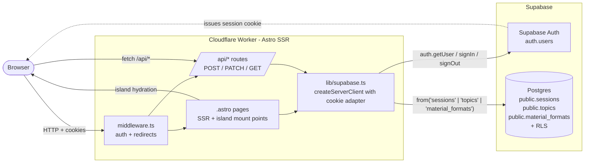
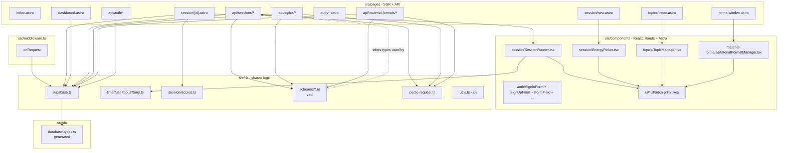
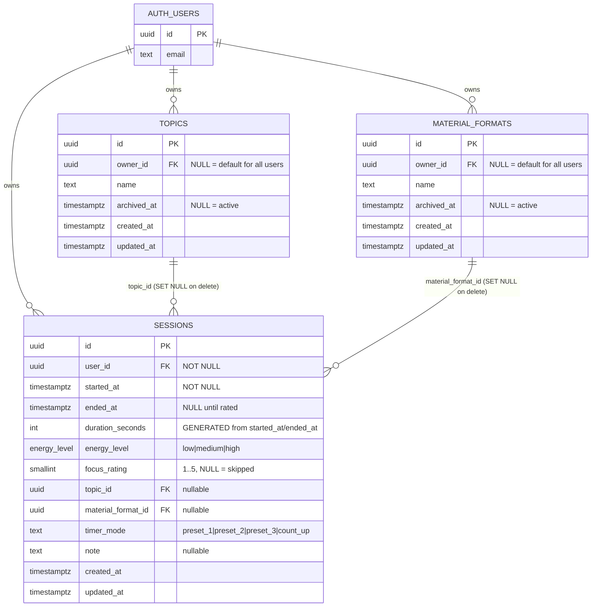
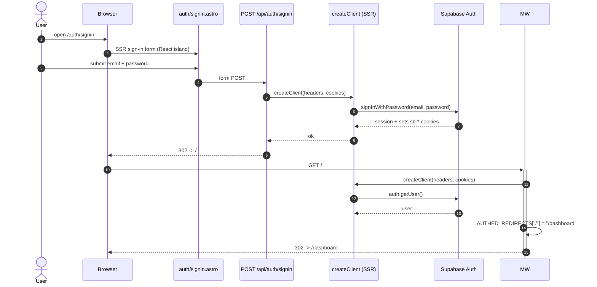
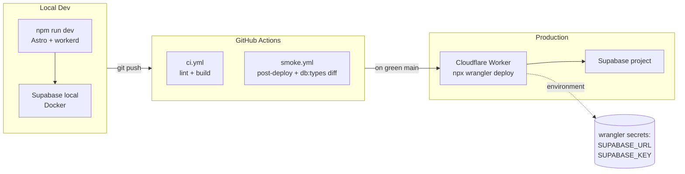

# PomoSapiens - Architecture Design

Snapshot as of 2026-06-28. Derived from `src/` and the closed changes in `context/archive/` (foundation through `2026-06-27-categorize-sessions-topic-format`).

PomoSapiens is an Astro 6 SSR app with React 19 islands, deployed on Cloudflare Workers. Persistence and auth run on Supabase (Postgres + Auth). All client state is intentionally thin: the server owns truth, the React islands own only the interactive UX.

---

## 1. System context

How a request flows from a browser through the stack to Supabase.



Key constraints baked into the diagram:

- Every request hits [middleware.ts](src/middleware.ts) first - it builds a Supabase client with the inbound `Cookie` header, calls `auth.getUser()`, writes the result to `context.locals.user`, and gates `PROTECTED_ROUTES` (`/dashboard`, `/session/`, `/topics`, `/formats`).
- The Worker has no in-process state. Every Supabase call is scoped to the caller's cookie -> RLS does the user-isolation work, not application code.
- API routes are SSR-only (`export const prerender = false;`) - prerendering them on Cloudflare would fail at build.

---

## 2. Module map

The grouping that `src/` actually has today. Pages and API routes are listed only at directory granularity to keep this stable across small additions.



Conventions worth pinning here:

- `@/` is the only allowed import prefix (tsconfig path alias) - no relative `../../`.
- Astro components render statically; React lives only where interactivity is required and is hydrated explicitly with `client:load`.
- shadcn/ui primitives live in `src/components/ui/` and are merged via `cn()` from [utils.ts](src/lib/utils.ts).

---

## 3. Domain model

Schema as of migration `20260627140018_add_archived_at_to_topics_and_formats.sql`.



RLS posture (enforced in the same migration that creates the tables):

- `sessions`: per-operation policies scoped to `authenticated`; row visibility requires `user_id = auth.uid()`. `DELETE` was reinstated (owner-scoped, any status) in `20260706120000_add_sessions_delete_policy.sql` to back the explicit-abandon flow (S-05) - a user can delete any of their own sessions, in progress or already ended.
- `topics`, `material_formats`: SELECT allows `owner_id IS NULL OR owner_id = auth.uid()` so seeded defaults (Video / Reading / ...) are visible to everyone; mutations are restricted to the owner.
- `anon` role: no policies => fully denied.
- A partial unique index on `(name) WHERE owner_id IS NULL` keeps two seeded defaults from sharing a name (Postgres treats NULLs as distinct in normal UNIQUE).

---

## 4. Class / module structure

Lightweight UML for the non-trivial modules. Astro pages and shadcn primitives are omitted - they have no behavior worth diagramming.

```mermaid
classDiagram
    class onRequest {
        +context: APIContext
        +next() Response
        -PROTECTED_ROUTES string[]
        -AUTHED_REDIRECTS Record~string,string~
    }

    class createClient {
        +createClient(headers, cookies) SupabaseClient~Database~ | null
    }

    class parseJson~T~ {
        +parseJson(request, schema) Promise~ParseResult~T~~
    }

    class resolveSessionPageAccess {
        +resolveSessionPageAccess(input) AccessResult
    }
    class AccessResult {
        <<union>>
        redirect:/dashboard
        allow:startedAtMs
    }

    class useFocusTimer {
        +useFocusTimer(opts) UseFocusTimerResult
        -phase running|rating
        -now number
        -stoppedAtMs number|null
        -audioRef HTMLAudioElement
        -onVisibility()
        +stopEarly()
    }

    class SessionRunner {
        -submitPhase rating|submitting
        -error string|null
        +handleRate(rating)
    }

    class EnergyPicker {
        -energy low|medium|high|null
        -topics Topic[]
        -formats MaterialFormat[]
        -topicId string|null
        -materialFormatId string|null
        +handleSubmit(e)
    }

    class TopicManager {
        -topics Topic[]
        -addOpen bool
        -renameId string|null
        +handleAdd()
        +handleRename()
        +handleArchive(id)
        +handleUnarchive(id)
    }

    class MaterialFormatManager {
        -formats MaterialFormat[]
        +handleAdd()
        +handleRename()
        +handleArchive(id)
        +handleUnarchive(id)
    }

    class SessionsApi {
        +POST() create session
        +PATCH(id) end + rate session
    }

    class TopicsApi {
        +GET() list topics
        +POST() create topic
        +PATCH(id) rename or archive/unarchive
    }

    class MaterialFormatsApi {
        +GET() list formats
        +POST() create
        +PATCH(id) rename or archive/unarchive
    }

    class Schemas {
        +createSessionSchema
        +endSessionSchema
        +createTopicSchema
        +updateTopicSchema
        +createMaterialFormatSchema
        +updateMaterialFormatSchema
        +signIn/signUp
    }

    onRequest --> createClient
    SessionsApi --> createClient
    SessionsApi --> parseJson
    SessionsApi --> Schemas
    TopicsApi --> createClient
    TopicsApi --> parseJson
    TopicsApi --> Schemas
    MaterialFormatsApi --> createClient
    MaterialFormatsApi --> parseJson
    MaterialFormatsApi --> Schemas

    SessionRunner --> useFocusTimer
    EnergyPicker --> SessionsApi : POST /api/sessions
    EnergyPicker --> TopicsApi : GET /api/topics
    EnergyPicker --> MaterialFormatsApi : GET /api/material-formats
    SessionRunner --> SessionsApi : PATCH /api/sessions/:id
    TopicManager --> TopicsApi
    MaterialFormatManager --> MaterialFormatsApi

    resolveSessionPageAccess ..> AccessResult
```

---

## 5. End-to-end flow: capture a focus session

The most load-bearing interaction in the product. It crosses every layer: middleware -> SSR page -> island -> API -> Postgres.

```mermaid
sequenceDiagram
    autonumber
    actor U as User
    participant B as Browser
    participant MW as middleware.ts
    participant NEW as session/new.astro
    participant EP as EnergyPicker island
    participant API1 as POST /api/sessions
    participant SID as session/[id].astro
    participant ACC as resolveSessionPageAccess
    participant SR as SessionRunner island
    participant TIM as useFocusTimer
    participant API2 as PATCH /api/sessions/:id
    participant PG as Postgres (RLS)

    U->>B: click "Start session"
    B->>MW: GET /session/new
    MW->>MW: auth.getUser -> locals.user
    MW-->>B: SSR /session/new (mounts EnergyPicker)
    B->>EP: hydrate (client:load)
    EP->>API1: GET /api/topics, /api/material-formats
    API1-->>EP: lists (filter archived_at)
    U->>EP: pick energy + optional topic/format -> Start
    EP->>EP: stage-1 audio prime (muted play/pause)
    EP->>API1: POST { energy_level, topic_id?, material_format_id? }
    API1->>PG: INSERT sessions (user_id from locals.user)
    PG-->>API1: { id, started_at }
    API1-->>EP: 201 { id, started_at }
    EP->>B: window.location.assign("/session/:id")

    B->>MW: GET /session/:id
    MW-->>SID: locals.user attached
    SID->>PG: SELECT id, started_at, ended_at, energy_level WHERE id, user_id
    PG-->>SID: row | null
    SID->>ACC: resolveSessionPageAccess(row, nowMs, 25*60)
    ACC-->>SID: allow{startedAtMs} | redirect /dashboard
    SID-->>B: SSR + SessionRunner island

    B->>SR: hydrate (client:load)
    SR->>TIM: useFocusTimer(startedAtMs, focusSeconds)
    TIM->>TIM: stage-2 audio re-prime
    loop every ~1s + on visibilitychange
        TIM->>TIM: setTimeout tick; remaining = focusSeconds - floor((now - startedAtMs)/1000)
    end
    TIM-->>SR: phase=running, remaining
    alt remaining <= 0 OR user clicks Stop early
        TIM->>TIM: stoppedAtMs := startedAtMs + focusSeconds*1000 (or Date.now())
        TIM->>TIM: play chime (fail-open)
        TIM-->>SR: phase=rating
    end

    U->>SR: pick rating 1-5 or Skip
    SR->>API2: PATCH { focus_rating, ended_at: ISO(stoppedAtMs) }
    API2->>API2: plausibility: ended_at <= now+5s AND >= now-2h
    API2->>PG: UPDATE sessions SET ended_at, focus_rating WHERE id, user_id, ended_at IS NULL
    PG-->>API2: row | empty
    alt empty (already ended or not yours)
        API2-->>SR: 409 "Session already ended or not found"
    else updated
        API2-->>SR: 200 { ok }
        SR->>B: window.location.assign("/dashboard")
    end
```

Invariants worth keeping in mind when changing this path:

- **Wall-clock derivation.** [useFocusTimer](src/lib/timer/useFocusTimer.ts) never trusts `setInterval` accumulation - the remaining time is always `focusSeconds - (Date.now() - startedAtMs)/1000`, recomputed on each `setTimeout` tick and on every `visibilitychange`. Background-tab throttling and tab-suspends are therefore harmless.
- **Audio priming is two-staged.** Stage 1 (muted play/pause inside the Start click handler) carries the user-activation; stage 2 (in `useFocusTimer`'s mount effect) re-primes inside the new document so the unmuted `play()` at focus-end is allowed by Safari.
- **Single-write rule on sessions.** [PATCH /api/sessions/:id](src/pages/api/sessions/[id].ts) filters on `.is("ended_at", null)`. A second rating attempt returns 409 - the row is effectively immutable once closed.
- **Plausibility window.** `ended_at` must be inside `[now - 2h, now + 5s]`. Beyond that we assume a tampered clock and reject.
- **Explicit abandon.** A user can remove an in-progress (or already-ended) session from history via the dashboard's `AbandonButton` island, which sends `DELETE /api/sessions/:id`. There is no age-based redirect anywhere in this path - [resolveSessionPageAccess](src/lib/session/access.ts) only redirects on a missing row or an already-ended row, regardless of how long the session has been running.

---

## 6. Auth flow

Cookie-based Supabase SSR auth. Covers email/password today; OAuth `callback` route is wired but not the primary path.



Notes:

- `AUTHED_REDIRECTS` is a hard map keyed by exact path, separate from `PROTECTED_ROUTES`'s `startsWith` matching. Adding a new auth-only-redirect (e.g. send signed-in users away from a landing variant) means a one-line addition there.
- [createClient](src/lib/supabase.ts) returns `null` when env vars are unset, so every caller already branches on that case. This is what keeps `npm run lint` / `build` green in CI without a live Supabase.
- `SUPABASE_SERVICE_ROLE_KEY` is **never** read by app code; it exists only for the pgTAP RLS test runner (`npm run db:test`).

---

## 7. Cross-cutting concerns

| Concern               | Where it lives                                                                         | Notes                                                                                                       |
| --------------------- | -------------------------------------------------------------------------------------- | ----------------------------------------------------------------------------------------------------------- |
| Routing + auth gating | [middleware.ts](src/middleware.ts)                                                     | `PROTECTED_ROUTES` prefix-match for gating, `AUTHED_REDIRECTS` exact-match for already-signed-in redirects. |
| Server -> DB client   | [lib/supabase.ts](src/lib/supabase.ts)                                                 | One factory; returns `null` when unconfigured. All callers handle that case.                                |
| Request validation    | [lib/parse-request.ts](src/lib/parse-request.ts) + [lib/schemas/](src/lib/schemas/)    | Every `POST` / `PATCH` parses the body through a zod schema; failure is a 400 with the schema message.      |
| Type generation       | [src/db/database.types.ts](src/db/database.types.ts)                                   | Generated by `npm run db:types` after every migration; committed so CI does not need a live DB.             |
| Timer correctness     | [lib/timer/useFocusTimer.ts](src/lib/timer/useFocusTimer.ts)                           | Wall-clock derivation + visibilitychange reconciliation. Pinned by L-03.                                    |
| Audio at focus-end    | `EnergyPicker` stage-1 prime + `useFocusTimer` stage-2 re-prime                        | Two-stage to satisfy Safari autoplay rules. Pinned by L-02.                                                 |
| Authorization         | RLS in [migrations/](supabase/migrations/) + `.eq("user_id", user.id)` in API handlers | Defence in depth: RLS is the wall, the API filter is the suspenders.                                        |
| Style + class merging | [lib/utils.ts](src/lib/utils.ts) `cn()`                                                | `clsx` + `tailwind-merge`. Never concatenate Tailwind class strings manually.                               |
| Pre-commit gating     | `.husky/` + `lint-staged`                                                              | `eslint --fix` on TS/TSX/Astro, `prettier` on JSON/CSS/MD. React Compiler ESLint rule is set to `error`.    |
| CI                    | `.github/workflows/ci.yml`, `smoke.yml`                                                | Lint + build on push/PR; smoke + db:types diff post-deploy.                                                 |

---

## 8. Deployment shape



- Local dev runs in the Cloudflare `workerd` runtime via `@astrojs/cloudflare`, so production parity is high.
- Astro `astro:env` validates `SUPABASE_URL` / `SUPABASE_KEY` at build, which is why CI requires repository secrets even for the build step.
- The Supabase project is plain managed Postgres + Auth - no edge functions, no realtime, no storage today.

---

## 9. Map back to the roadmap

The shipped pieces these diagrams reflect (from `context/archive/`):

- F-01 `sessions-data-foundation` - the `sessions` / `topics` / `material_formats` schema and RLS.
- S-02 `first-session-capture-loop` - `EnergyPicker` + `SessionRunner` + the timer + the `POST` / `PATCH` API + dashboard list.
- `categorize-sessions-topic-format` - `topic_id` / `material_format_id` selectors on session start, `archived_at` soft-delete, `TopicManager` / `MaterialFormatManager` CRUD UIs.
- Test scaffolding - `testing-api-contract`, `test-timer-sm`, `testing-schema-validation-gate`, `testing-e2e-session-capture-flow` (drives the API/timer/E2E tests that pin the invariants called out in section 5).
- Landing - `landing-page` (the `index.astro` -> `Welcome` route, redirected away for authed users by `AUTHED_REDIRECTS`).

Anything not in this document (notes on sessions, explicit-abandon flow, count-up timer mode, additional timer presets) is roadmap-only and not yet wired into the schema or UI - the `timer_mode` / `note` columns exist nullably as anticipating placeholders.
