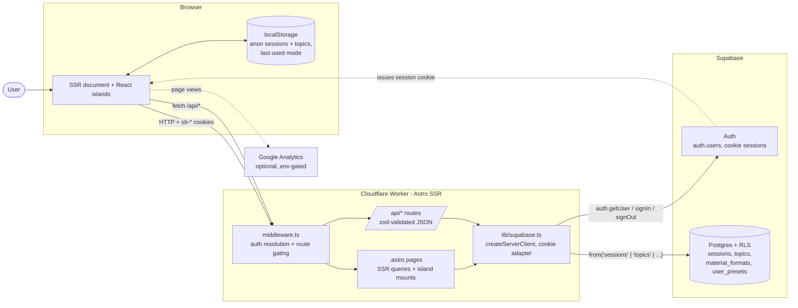
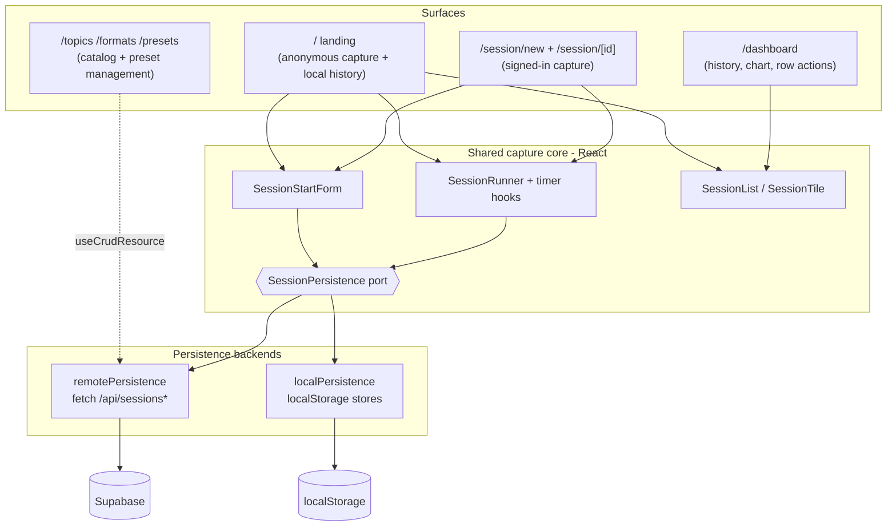
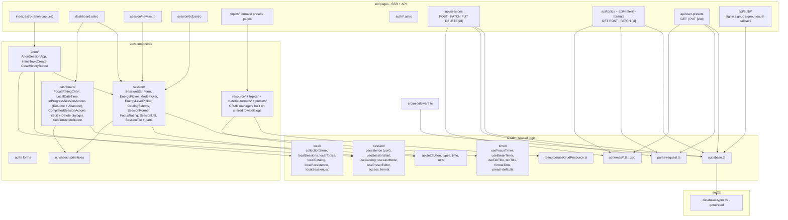
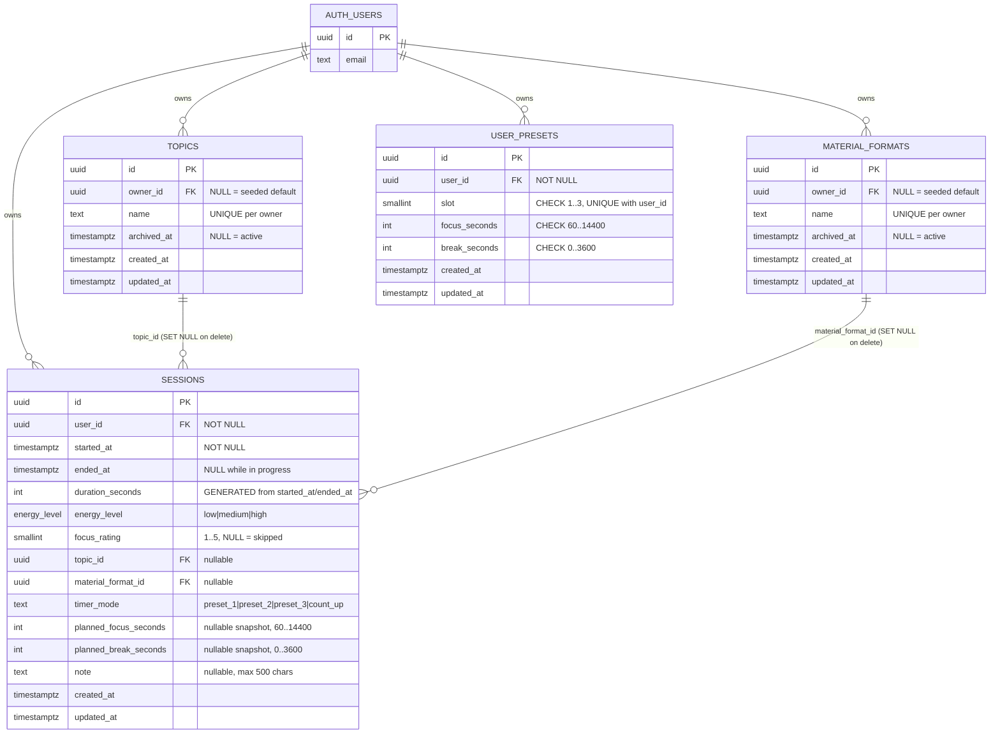
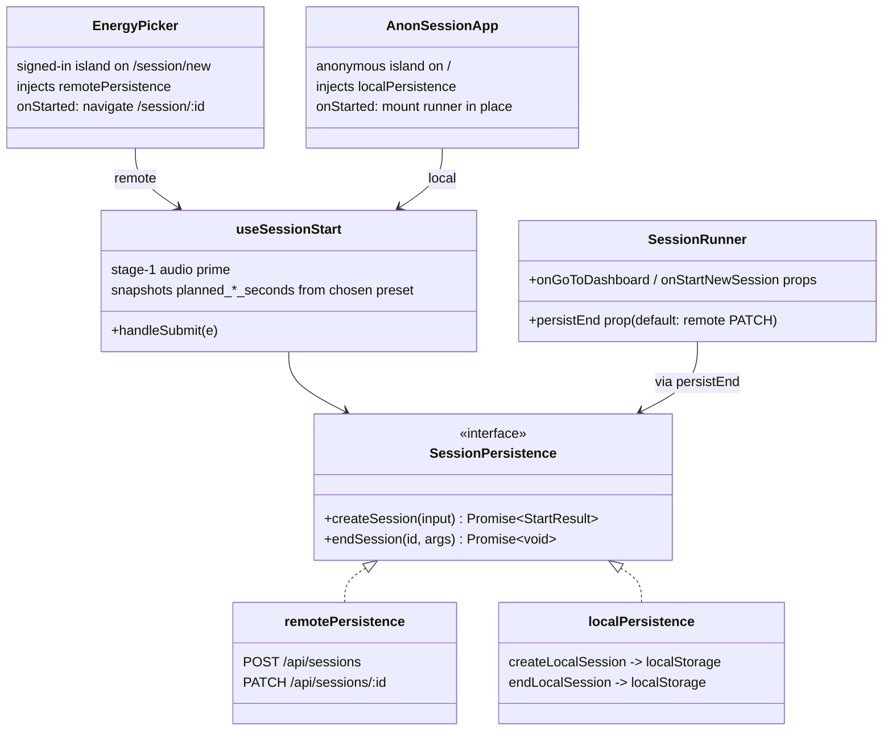
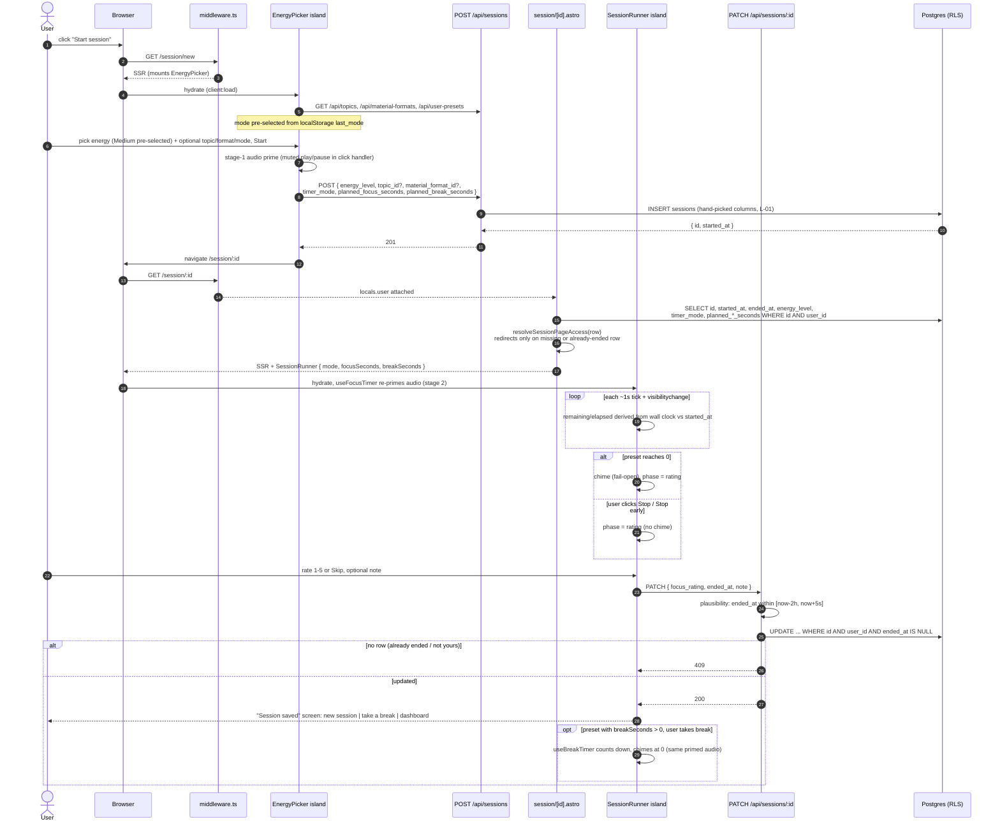
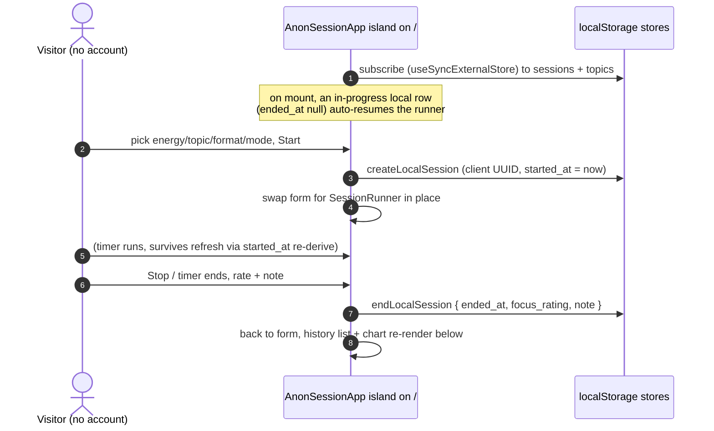
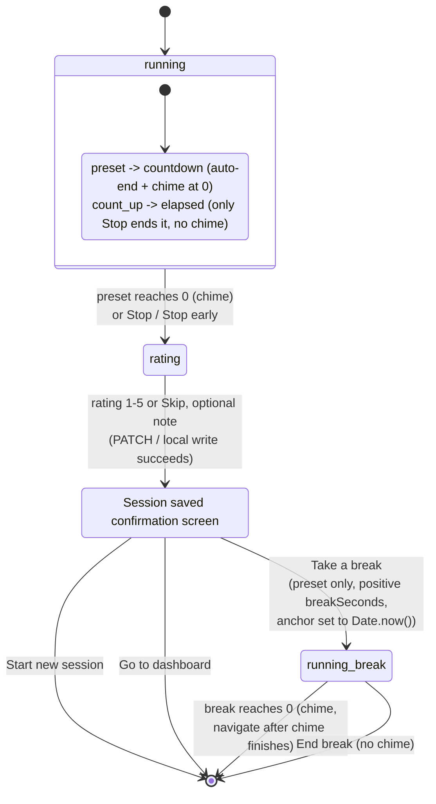
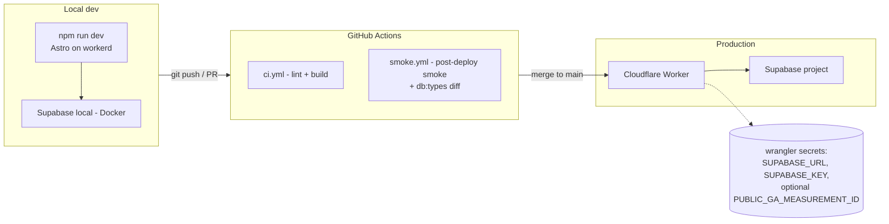

# PomoSapiens - Architecture

Snapshot as of 2026-07-13. Derived from `src/` and the closed changes in `context/archive/` (foundation through `2026-07-13-reopen-running-session`). Edit-in-place; per-change deltas live next to their plans in `context/archive/<change>/`.

---

## 1. Introduction

PomoSapiens is a Pomodoro-style focus tracker whose product wedge is **contextual capture bound to each timed session**: before a session the student records energy level (plus optional topic, material format, and timer mode), and after it a 1-5 focus rating and an optional note. The history view and a focus-rating chart let the user see which study conditions correlate with their own self-rated focus.

The system is an **Astro 6 SSR application** (`output: "server"`) with **React 19 islands**, styled with **Tailwind 4** and **shadcn/ui**, deployed to **Cloudflare Workers** via `@astrojs/cloudflare`. Persistence and identity run on **Supabase** (Postgres with row-level security + Supabase Auth with cookie-based SSR sessions). Request bodies are validated with **zod**; the focus-rating chart uses **Recharts**.

Two architectural stances shape everything below:

1. **The server owns truth for signed-in users.** React islands hold only interactive UX state; every durable fact lives in Postgres behind RLS, and pages re-derive their view from a fresh SSR query on each load. State transitions that matter (session created, session ended) are full-page navigations, not client cache updates.
2. **One deliberate exception: the anonymous path.** An unauthenticated visitor can run the full capture loop on `/`, persisted entirely to `localStorage`. This second persistence backend is kept from diverging by a small injected port (`SessionPersistence`) rather than branching inside components -- the same form, runner, and history components serve both backends.

Reading guide: §2 gives the block-level picture, §3-§5 the static structure (modules, schema, persistence seam), §6-§7 the dynamic behavior (flows and the timer state machine), §8-§10 cross-cutting concerns, deployment, and the roadmap mapping.

---

## 2. High-level overview

### 2.1 System context

Constraints baked into this picture:

- Every request passes through [middleware.ts](src/middleware.ts) first. It builds a Supabase client from the inbound cookies, resolves the user into `context.locals.user`, redirects signed-in visitors off exact-match paths in `AUTHED_REDIRECTS` (`/`, `/auth/signin`, `/auth/signup` all lead to `/dashboard`), and redirects anonymous visitors off prefix-matched `PROTECTED_ROUTES` (`/dashboard`, `/session/`, `/topics`, `/formats`, `/presets`).
- The Worker holds no in-process state. Every Supabase call is scoped to the caller's cookie, so RLS does the user-isolation work; API handlers add `.eq("user_id", ...)` filters as defence in depth.
- API routes are SSR-only (`export const prerender = false;`); prerendering them would fail the Cloudflare build.
- `localStorage` is a real persistence tier, not a cache: for anonymous visitors it is the _only_ store (sessions + topics, versioned envelopes, cross-tab sync). For signed-in users it carries exactly one convenience key, the last-used timer mode.

### 2.2 High-level module interaction

The application has four interaction surfaces, all composed from one shared capture core:

- The **capture core** (form, runner, tile list) is presentational and backend-agnostic. Which backend it writes to is decided by the mounting island: `EnergyPicker` (signed-in) injects `remotePersistence`, `AnonSessionApp` (landing page) injects `localPersistence`.
- The **dashboard** is signed-in only and reads Postgres directly in Astro frontmatter (RLS-scoped SELECT), then hands plain rows to the `SessionList` island. The anonymous landing page renders the same `SessionList` in `readOnly` mode from localStorage-derived rows.
- **Management pages** (topics, formats, presets) are thin CRUD UIs over their API routes, unified behind the `useCrudResource` hook.

---

## 3. Module map

The grouping `src/` actually has today. Pages and API routes at file granularity; components at directory granularity where a directory is uniform.

Conventions worth pinning:

- `@/` is the only import prefix (tsconfig path alias); no relative `../../`.
- Astro renders everything static; React exists only where interactivity is required and is hydrated explicitly (`client:load`, or `client:only="react"` for `FocusRatingChart`, which needs real browser layout for Recharts' `ResponsiveContainer`).
- shadcn/ui primitives live in `src/components/ui/`; class merging goes through `cn()` from [utils.ts](src/lib/utils.ts).
- Duplication is factored into shared modules, established by the 2026-07-10 refactor: one `fetchJson` helper, one `types.ts` domain vocabulary, `useCatalog`/`CatalogSelects` for topic/format pickers, `ConfirmActionButton` for two-step destructive actions, `useCrudResource` behind both catalog managers, and sibling row-controls extracted into composition components (`InProgressSessionActions`, `CompletedSessionActions` -- lesson L-07).
- [Layout.astro](src/layouts/Layout.astro) is the single shell: optional Google Analytics (env-gated), missing-config banners from [config-status.ts](src/lib/config-status.ts), and a `Topbar` shown only to signed-in users.

---

## 4. Domain model

Schema as of migration `20260706120000_add_sessions_delete_policy.sql` (the latest of eight).

Modeling decisions:

- **`planned_*_seconds` are snapshots, not references.** There is deliberately no FK from `sessions` to `user_presets`: the planned durations are copied onto the row at POST time so that editing a preset slot later never rewrites how past sessions are summarised.
- **`duration_seconds` is a generated column** (from `started_at`/`ended_at`), so "actual elapsed wall time" is correct for every mode, count-up included, with no application arithmetic.
- **A session's lifecycle is written in `ended_at`**: `NULL` means in progress (any age -- there is no time-based "abandoned" heuristic, lesson L-05), non-NULL means done. Status is derived, never stored.

RLS posture:

- `sessions`: per-operation policies scoped to `authenticated`, all requiring `user_id = auth.uid()`. DELETE history is deliberate and two-step: dropped in `20260601...` ("sessions are immutable"), then reinstated fully open (owner can delete any own row, ended or not) in `20260706...` for the explicit-abandon flow -- do not "fix" it back (lesson L-06).
- `topics`, `material_formats`: SELECT allows `owner_id IS NULL OR owner_id = auth.uid()` so seeded defaults are visible to everyone; mutations owner-only. A partial unique index on `(name) WHERE owner_id IS NULL` keeps seeded defaults distinct.
- `user_presets`: strictly per-user (no NULL-owner clause) with **no DELETE policy** -- the three slots always exist logically; defaults live in app code ([preset-defaults.ts](src/lib/timer/preset-defaults.ts)) and are merged server-side by `GET /api/user-presets`, not seeded into the table.
- `anon` role: no policies anywhere; fully denied. The anonymous feature never touches Postgres.
- pgTAP suites under `supabase/tests/` pin the cross-user isolation per table (`npm run db:test`).

### The anonymous mirror

The localStorage tier mirrors the same domain with the same vocabulary, one versioned envelope (`{ v: 1, items }`) per collection:

| Server table       | Anonymous equivalent                                                                                                      |
| ------------------ | ------------------------------------------------------------------------------------------------------------------------- |
| `sessions`         | [localSessions.ts](src/lib/local/localSessions.ts) store, client `crypto.randomUUID()` ids, capped at the newest 200 rows |
| `topics`           | [localTopics.ts](src/lib/local/localTopics.ts) store, name-unique like the server constraint                              |
| `material_formats` | fixed constants in [localCatalog.ts](src/lib/local/localCatalog.ts) (the five defaults; no creation)                      |
| `user_presets`     | fixed `DEFAULT_PRESETS` constants (no editing)                                                                            |

Client UUIDs and name-unique topics were chosen to mirror the server schema exactly, so the future account-merge slice (S-09) reconciles on the same keys the server already enforces. Stores are built on [collectionStore.ts](src/lib/local/collectionStore.ts): `useSyncExternalStore`-based, SSR-safe (server snapshot upgrades to the client read after hydration), fail-open on quota/parse errors, and fanned out across tabs via the `storage` event.

---

## 5. The session persistence seam

The one place the two backends meet. Introduced by the anonymous-sessions change; everything that writes a session goes through this port.

Why a port and not branching: six call sites would otherwise each need an `if (anonymous)` arm, and history/chart components would silently read only one backend. Instead the backend choice is made once, at the island boundary, and every shared component stays oblivious. The two implementations also differ in navigation semantics -- the remote path navigates to `/session/[id]` (unmounting the form), while the local path stays mounted on `/` and swaps the runner in place via the `onStarted` / `onGoToDashboard` callbacks.

---

## 6. End-to-end flows

### 6.1 Capture a focus session (signed-in)

The load-bearing interaction; it crosses every layer.

Invariants on this path (pinned by lessons L-01/L-02/L-03 and the test suite):

- **Wall-clock derivation** ([useFocusTimer](src/lib/timer/useFocusTimer.ts)): remaining/elapsed is always recomputed from `Date.now() - startedAtMs` on a 1 s `setTimeout` chain and on every `visibilitychange`; nothing decrements a counter, so background-tab throttling is harmless. The same rule covers the break countdown (anchored at "Take a break") and count-up elapsed.
- **Two-stage audio prime**: stage 1 in the Start click handler ([useSessionStart](src/lib/session/useSessionStart.ts)), stage 2 on runner mount, chime fired from the stored `audioRef`, always fail-open.
- **Column-scope discipline (L-01)**: zod strips unknown keys, and every write uses a hand-picked column set (`POST` insert, `PATCH` exactly `{ ended_at, focus_rating, note }`) -- never `.update(parsed.data)`.
- **Write-once end**: `PATCH` filters `.is("ended_at", null)`; a second attempt returns 409. The `[now-2h, now+5s]` plausibility window is a clock-tampering guard, not a duration cap.
- **Access guard** ([access.ts](src/lib/session/access.ts)): `/session/[id]` redirects only on a missing row (covers cross-user via RLS) or an already-ended row. No age-based logic anywhere (L-05).
- **Tab title** ([useTabTitle](src/lib/timer/useTabTitle.ts)): the running phases mirror the clock into `document.title`; details in §7.

### 6.2 Anonymous capture on `/`

Same core loop, different backend, no navigation:

Notable differences from the signed-in path: topics can be created inline (no management page is exposed), formats and presets are fixed constants, history is read-only (`SessionList readOnly` hides all row actions) with a "clear history" control, and the audio prime never needs stage 2 because the flow never leaves the document. Refresh-resume falls out of the same wall-clock derivation. No server row is ever created; merging this data into an account after sign-up is the not-yet-built S-09.

### 6.3 History management on the dashboard

[dashboard.astro](src/pages/dashboard.astro) SSRs one RLS-scoped SELECT (newest 50 rows, topic/format names joined) and derives the chart series from rated rows. Each row's affordances depend only on derived status:

| Row status                    | Controls                                                                                                                                  | Path                                                          |
| ----------------------------- | ----------------------------------------------------------------------------------------------------------------------------------------- | ------------------------------------------------------------- |
| In progress (`ended_at` NULL) | **Resume** (navigate back into `/session/[id]`, timer redrawn from `started_at`) + **Abandon** (two-step confirm, hard delete)            | `InProgressSessionActions`: link + `DELETE /api/sessions/:id` |
| Done                          | **Edit** (modal, all captured fields; duration edit recomputes `ended_at` server-side, `started_at` fixed) + **Delete** (confirm-guarded) | `CompletedSessionActions`: `PUT` / `DELETE /api/sessions/:id` |

The `PUT` edit path is deliberately separate from the end-session `PATCH`: it requires the row to be already ended, has no plausibility window and no write-once guard, and re-validates duration to a 1 s..24 h bound. All mutations end in a full page reload, so the list and chart re-derive from current rows with no client cache to invalidate.

### 6.4 Auth

Cookie-based Supabase SSR auth: email + password with verification (redirect to `/auth/confirm-email`) plus Google OAuth (`/api/auth/oauth` + `/api/auth/callback`). Sign-in POSTs to `/api/auth/signin`, which calls `signInWithPassword` through the SSR client; Supabase sets `sb-*` cookies on the response, and the follow-up request to `/` is bounced by the middleware's `AUTHED_REDIRECTS` to `/dashboard`. [supabase.ts](src/lib/supabase.ts) returns `null` when env is unconfigured, and every caller branches on that -- this is what keeps CI's lint/build green without a live Supabase. `SUPABASE_SERVICE_ROLE_KEY` is never read by app code; it exists only for the test runners.

---

## 7. Timer state machine

Owned by [SessionRunner](src/components/session/SessionRunner.tsx); `useFocusTimer` and `useBreakTimer` are sub-machines feeding it, `useTabTitle` mirrors it into the tab strip.

Properties worth knowing before touching it:

- **The DB row is terminal before the break starts.** Everything from `saved` onward is client-only; a refresh during a break simply lands wherever the exit callback points (dashboard for signed-in, the form for anonymous).
- **One chime asset, two fire sites** (focus-end, break-end), both through the same primed `audioRef`. User-initiated stops never chime.
- **Tab title tracks the phase**: `⏱ MM:SS - PomoSapiens` while focusing / counting up, `☕ MM:SS - PomoSapiens` during a break, restored on stop/unmount. If a phase ends while the tab is hidden, the title blinks an alert (`✅ Focus done!` / `Break over!` alternating with `⏰ ⏰ ⏰`) until the user refocuses; a break that ends hidden also holds the dashboard navigation until refocus. Worst-case failure is a stale title string -- cosmetic by design.
- **Exit callbacks are injected** (`onGoToDashboard`, `onStartNewSession`, `persistEnd`), which is exactly what lets the anonymous island reuse the whole machine without navigation.

---

## 8. Cross-cutting concerns

| Concern               | Where it lives                                                                          | Notes                                                                                                             |
| --------------------- | --------------------------------------------------------------------------------------- | ----------------------------------------------------------------------------------------------------------------- |
| Routing + auth gating | [middleware.ts](src/middleware.ts)                                                      | `PROTECTED_ROUTES` prefix-match; `AUTHED_REDIRECTS` exact-match (`/`, `/auth/signin`, `/auth/signup`).            |
| Server -> DB client   | [lib/supabase.ts](src/lib/supabase.ts)                                                  | One factory, typed `SupabaseClient<Database>`; returns `null` when unconfigured and all callers handle it.        |
| Request validation    | [lib/parse-request.ts](src/lib/parse-request.ts) + [lib/schemas/](src/lib/schemas/)     | Every POST/PATCH/PUT body goes through a zod schema; failure is a 400. Zod's default-strip is layer 1 of L-01.    |
| Authorization         | RLS in [supabase/migrations/](supabase/migrations/) + `.eq("user_id", ...)` in handlers | RLS is the wall, the API filter is the suspenders. pgTAP (`npm run db:test`) is the cross-user regression net.    |
| Client fetch          | [lib/api/fetchJson.ts](src/lib/api/fetchJson.ts)                                        | Single helper for all island -> API calls; per-site fallback error messages.                                      |
| Domain vocabulary     | [lib/types.ts](src/lib/types.ts) + [db/database.types.ts](src/db/database.types.ts)     | Generated DB types (`npm run db:types`, committed) + hand-written view types (`SessionListItem`, `Mode`, ...).    |
| Timer correctness     | [lib/timer/](src/lib/timer/)                                                            | Wall-clock derivation on three anchors (focus, count-up, break). Pinned by L-03 and the unit suite.               |
| Audio                 | stage-1 prime in `useSessionStart`, stage-2 in `useFocusTimer`                          | Two-stage to satisfy Safari autoplay; fail-open. Pinned by L-02.                                                  |
| Client persistence    | [lib/local/](src/lib/local/) + [useLastMode](src/lib/session/useLastMode.ts)            | Versioned envelopes, SSR-safe `useSyncExternalStore`, `storage`-event cross-tab sync, 200-session cap, fail-open. |
| Style + class merging | [lib/utils.ts](src/lib/utils.ts) `cn()`                                                 | `clsx` + `tailwind-merge`; never concatenate class strings.                                                       |
| Config health         | [lib/config-status.ts](src/lib/config-status.ts) + `Banner`                             | Missing env surfaces as an in-app banner instead of a crash.                                                      |
| Pre-commit gating     | `.husky/` + `lint-staged`                                                               | `eslint --fix` (React Compiler rule at `error`) + `prettier`.                                                     |
| Tests                 | `tests/unit`, `tests/integration/api`, `tests/e2e`, `supabase/tests`                    | Vitest unit + API-contract integration, Playwright e2e (authed + anonymous fixtures), pgTAP RLS suites.           |
| CI                    | `.github/workflows/ci.yml`, `smoke.yml`                                                 | Lint + build on push/PR; post-deploy smoke + `db:types` drift gate.                                               |

---

## 9. Deployment shape

- Local dev runs in the Cloudflare `workerd` runtime via `@astrojs/cloudflare`, so prod parity is high; auto-deploy on merge to `main` goes through Cloudflare's GitHub integration.
- `astro:env` validates `SUPABASE_URL` / `SUPABASE_KEY` at build time, which is why CI needs the repository secrets even for the build step.
- Supabase is plain managed Postgres + Auth: no edge functions, no realtime, no storage. Observability is Cloudflare's built-in `observability.enabled`; no app-level logger or error tracker (accepted v1 floor).

---

## 10. Map back to the roadmap

Shipped and reflected in this document (see `context/foundation/roadmap.md` and `context/archive/`):

- **F-01 / S-01 / S-02** - schema + RLS, the capture loop (form, timer, rating, history), topic/format catalogs.
- **S-03** (`timer-presets`) - `user_presets`, `planned_*_seconds` snapshots, count-up mode, opt-in break, last-used mode in localStorage, removal of age-based access guards.
- **S-04** (`session-notes-and-chart`) - `note` on the rating screen and history tiles; `FocusRatingChart` (Recharts, `client:only`).
- **S-05 / S-07 / S-11** - the dashboard row-action set: Abandon (delete, in-progress), Edit + Delete (done rows), Resume (back into a running session).
- **S-06** (`tab-title-timer`) - `useTabTitle` with hidden-tab blink alerts.
- **S-08** (`anonymous-sessions`) - the localStorage tier, the `SessionPersistence` port, `AnonSessionApp` on `/`.
- **S-12** + the 2026-07-10 React refactor - the current component decomposition (🍅 duration badges, `SessionStartForm` extraction, shared CRUD/confirm/catalog modules).
- Test hardening changes (`testing-api-contract`, `test-timer-sm`, `testing-schema-validation-gate`, `testing-e2e-session-capture-flow`) - the suites that pin §6's invariants.

Not built yet (and deliberately absent above): **S-09** `anonymous-session-sync` (merging local data into an account on sign-in) and **S-10** `continue-session-past-end` (converting a running preset session to count-up at its scheduled end -- in planning on the `continue-session-past-end` branch). S-10 will touch §7's state machine: it introduces the first mid-flight `timer_mode` transition, which several components currently assume is fixed for a session's lifetime.
